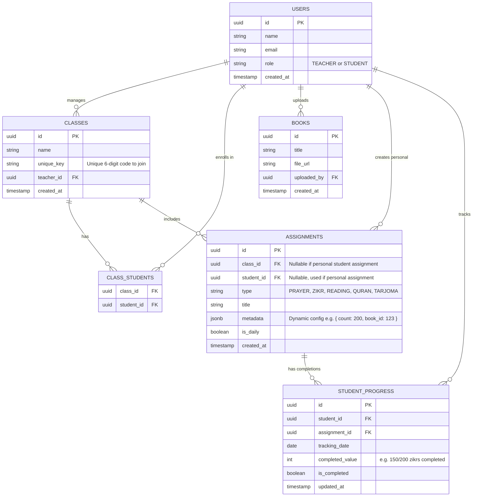

# Al-Mu'allim (Islamic Classroom App) Implementation Plan

Based on the requirements and the "Al-Mu'allim" designs provided, this application will serve as a platform for teachers to assign daily religious practices, track student progress, and allow students to build their own habits.

### Phase 5: UI Implementation (Student)

This phase focuses on the mobile-first student experience. The goal is to make it incredibly easy and rewarding for students to log their daily habits.

#### 1. Join Class Flow
- **`src/app/student/join/page.tsx`**: A simple, aesthetic screen where the student enters the 6-character Class Code provided by their teacher.
- **Server Action (`actions.ts`)**: 
  - Validates the code against the `classes` table.
  - Inserts a new record into `class_students` linking the student to the class.
  - Redirects them instantly to their new Dashboard.

#### 2. Student Dashboard (`src/app/student/dashboard/page.tsx`)
- **The "Salam" Header**: Welcomes the student by name and displays a 🔥 **Streak Counter** (calculated by checking consecutive days of activity in `student_progress`).
- **Data Fetching Engine**:
  - Fetch all active `assignments` from classes the student is enrolled in.
  - Fetch today's `student_progress` logs to see what is already done.
  - Group the assignments by `category` (e.g., all "Prayer" tasks together, all "Zikr" tasks together) so the UI perfectly matches the user's daily routine.

#### 3. Dynamic Assignment Completion Components
Because our assignments are infinitely flexible, our completion UI must be too. We will build two interactive Client Components:
- **`CheckboxTracker.tsx`**: For 'checkbox' assignments (like Prayers). A large, satisfying button. Tapping it instantly saves `{ is_completed: true }` to the database.
- **`CounterTracker.tsx`**: For 'counter' assignments (like 200 Zikr or 30 mins Sport). 
  - Displays a progress bar (e.g., 50/200).
  - Tapping it opens a quick "Log Progress" drawer where they can type a number, or use a "+" button like a digital Tasbeeh.
  - Saves the `quantity` to the database. If `quantity >= target`, it automatically marks `is_completed = true`.

#### 4. Personal Analytics (`src/app/student/analytics/page.tsx`)
- **Goal:** Give students a rewarding visualization of their hard work to encourage consistency.
- **Key Metrics Row:** Display "Current Streak", "Total Completed Tasks", and "Average Completion Rate".
- **The Weekly Chart:** A beautiful, custom Tailwind-based Bar Chart showing their performance over the last 7 days (e.g., Monday: 100%, Tuesday: 80%).
- **Recent Achievements (Placeholder):** A sneak-peek section for Badges (to be fully built in Phase 6).

## Phase 6: Polish & Gamification (Making it Dynamic)

This final phase brings the beautiful UI to life by wiring all static numbers to real database calculations.

### 1. Dynamic Analytics Engine
We will create a central utility or server actions to calculate:
- **Current Streak:** Look back day-by-day in `student_progress` to see how many consecutive days the student has completed at least one task.
- **Total Points:** Every completed task = 10 Knowledge Points.
- **Discipline Checklist:** Group the student's progress by `assignments.category`. Calculate `(completed / total_assigned) * 100` to feed the exact percentages into the horizontal bars.
- **Weekly Chart:** Fetch the last 7 days of `student_progress` and calculate the daily completion rate to drive the heights of the Bar Chart.

### 2. Updating the UI Components
- **[MODIFY]** `src/app/student/dashboard/page.tsx`
  - Replace static streak and task counts with the live calculations.
- **[MODIFY]** `src/app/student/analytics/page.tsx`
  - Feed the dynamic weekly array into the Bar Chart.
  - Render the Discipline Checklist from the dynamic category percentages.

> [!IMPORTANT]
> **Open Question for User regarding Prayers:** 
> For the 5-Prayer block, do you want to keep the current setup (Teacher creates 5 separate checkbox assignments, which works perfectly right now), OR do you want me to write custom logic so the Teacher creates *one* assignment called "Daily Prayers", and the system automatically breaks it into 5 checkboxes on the student side?

> [!WARNING]
> **Open Question regarding Next Prayer Widget:**
> Do you want me to integrate a free external API (like Aladhan.com) to get real prayer times based on the user's location, or keep it static for this MVP?

### 3. Final Polish & Responsive Design
To wrap up the application, we will:
- **Responsive Layouts:** Add Tailwind `md:` and `lg:` breakpoints to ensure the beautiful 3-column desktop layout gracefully stacks into a vertical layout on mobile devices.
- **Loading States:** Create Next.js `loading.tsx` files for the dashboards. Instead of a blank screen while querying Supabase, the user will see beautiful, shimmering "Skeleton" versions of the UI.
- **Error Boundaries:** Add `error.tsx` files to gracefully catch any API failures (e.g., if Aladhan API is down) without breaking the app.

> [!IMPORTANT]
> **Open Question for User regarding Final Polish:** 
> Do you want me to proceed with implementing standard shimmering Skeleton Loaders for the loading states, and ensuring everything stacks cleanly on mobile? Or do you have specific loading animations/mobile designs in mind?

## Proposed GitHub Repository Names
- `al-muallim` (Based on the title in the design mockup)
- `tarbiyah-tracker`
- `deen-classroom`
- `sunnah-connect`

## Tech Stack Recommendations

### Database
**Recommendation:** **PostgreSQL**
*Why?* The app requires structured relationships (Teachers -> Classes -> Students -> Assignments), which is perfect for a robust relational database. However, the *types* of assignments are highly dynamic (e.g., Zikr counts, reading pages, prayer types). PostgreSQL's `JSONB` column type will allow us to store these dynamic assignment configurations (metadata) easily, giving us the best of both SQL and NoSQL worlds.

### Authentication
**Recommendation:** **Supabase Auth** or **Firebase Authentication**
*Why?* Both provide seamless, secure authentication that works identically across Web and Mobile. They support email/password, as well as social providers (Google, Apple). 
*Bonus:* If you choose Supabase, it pairs natively with PostgreSQL, providing a unified Backend-as-a-Service which will drastically speed up development for both web and mobile.

### Application Architecture
- **Web App:** Next.js (React) for a fast, responsive, and SEO-friendly web platform.
- **Mobile App (Future):** React Native (with Expo) to allow sharing code and concepts between the web and mobile platforms.
- **Backend API:** Next.js API routes (if using Supabase directly) OR a dedicated Node.js/Express server (if you want to keep the backend strictly separated).
- **Styling:** Tailwind CSS to easily and perfectly match the deep green (`#004D40` or similar) and modern glassmorphism aesthetics of your design.

## How a Single Table Handles All Assignment Types

In the ER diagram you provided, there are separate tables for Zikr, Books, Prayers, etc. While this works, it can quickly become difficult to maintain as you add more assignment types in the future. 

Instead, we can cover **all types** of assignments in a single `ASSIGNMENTS` table by using a `JSONB` (JSON) column called `metadata`. This allows the structure of the assignment to change dynamically based on its `type` without needing new tables or database migrations.

Here is how the `metadata` column would look for the different types you mentioned:

- **Zikr:**
  `{ "zikr_phrase": "Astaghfirullah", "target_count": 200 }`
- **Book Reading:**
  `{ "book_id": "uuid-of-book", "start_page": 10, "end_page": 20 }`
- **Prayer (5 Times a Day):**
  `{ "prayers_required": ["Fajr", "Dhuhr", "Asr", "Maghrib", "Isha"] }`
- **Specific Prayer (Tahajud/Nafl):**
  `{ "prayer_name": "Tahajud" }`
- **Quran Recitation:**
  `{ "surah_name": "Yaseen", "start_ayat": 1, "end_ayat": 83 }`
- **Quran Tarjoma:**
  `{ "surah_name": "Al-Baqarah", "start_ayat": 1, "end_ayat": 5 }`

The `STUDENT_PROGRESS` table then tracks the completion of these dynamic assignments. For example, for a Zikr assignment, the `completed_value` might be `150` (out of 200). For a book reading, `is_completed` would be set to `true`.

## Entity-Relationship (ER) Diagram

## Analytics Approach
To show analytics for teachers (how students are performing) and for students (their own streaks and performance):
- We will query the `STUDENT_PROGRESS` table, filtering by `tracking_date`.
- We can aggregate data to calculate "streaks" (consecutive days where `is_completed` is true).
- For class-wide analytics, the teacher queries all `STUDENT_PROGRESS` linked to `ASSIGNMENTS` that belong to their `class_id`.

## User Review Required

> [!IMPORTANT]
> Please review the proposed architecture, tech stack, and ER diagram. Let me know:
> 1. Which repository name you would like to use so I can initialize the project.
## Phase 7: Student Dashboard Redesign & Multi-Zikr Tracking

Your new design is absolutely stunning! It completely solves the "Multiple Zikr" problem by introducing sleek, stackable tracker rows instead of the massive blocky cards. It also upgrades the app to a professional, modern Sidebar layout!

Here is the plan to implement this exact design:

### 1. Global Layout Redesign (`src/app/student/layout.tsx`)
We will shift the application structure:
- **Remove Top Navigation**: Move the links (Dashboard, Joined Classes, Assignments, Analytics, Library, Support, Sign Out) to a fixed **Left Sidebar**.
- **Top Header Area**: Build the new clean header containing the Date, Notification Bell, Settings Icon, and User Profile.

### 2. Top Stats Row (`src/app/student/dashboard/page.tsx`)
- Build the two wide aesthetic cards for **Daily Streak** (with the "+2 today" indicator) and **Overall Completion** (with the horizontal progress bar).

### 3. Left Column (Spiritual Rituals)
To ensure the layout perfectly balances your master list of assignments, the left side of the screen will contain:
- **Daily Zikr Tracking**: Counters for Astaghfirullah, La ilaha illallah, etc.
- **Daily Prayers**: 5 daily prayers (marked only if prayed with Jamat).
- **Nawafil**: Cards for Maghrib Nafl, Before Witr, Duha, and Ishraq.

### 4. Right Column (Academic & Self-Improvement)
The right side of the screen will hold the remaining disciplines:
- **Tilawat, Hadith, & Tarjoma**: Individual cards for Quran recitation and reading.
- **Avoid Mankirat (The 5 Senses)**: Interactive trackers allowing the student to mark their percentage of avoiding bad actions with their Mouth, Nose, Eye, Ear, and Touch.
- **Sport**: A daily checkbox for physical activity.

### 5. Joined Classes Redesign
Update the Class Cards at the bottom of the dashboard:
- Integrate placeholder stock images of Islamic books/patterns (since we don't have user-uploaded covers yet).
- Add the Level badges ("Intermediate", "Foundational").
- Build the beautiful dotted "Browse More Classes" placeholder card.

### 6. Specialized Teacher UI Automation
Because the Student UI relies on specialized, hard-coded widgets for Munkarat and Prayer, the Teacher Dashboard will be automated:
- When a teacher creates a "Munkarat" assignment, the title will automatically lock to "Avoid five sense Munkarat".
- When a teacher creates a "Prayer" assignment, the title will automatically lock to "Five time Jamat prayer".
- The tracking configurations (checkbox vs target) will be hidden from the teacher to guarantee the database receives the correct format that the Student widgets expect.
- The `student_progress` database table has been upgraded with a `progress_data JSONB` column to securely hold complex multi-value data (like the 5 independent percentages for Munkarat).
