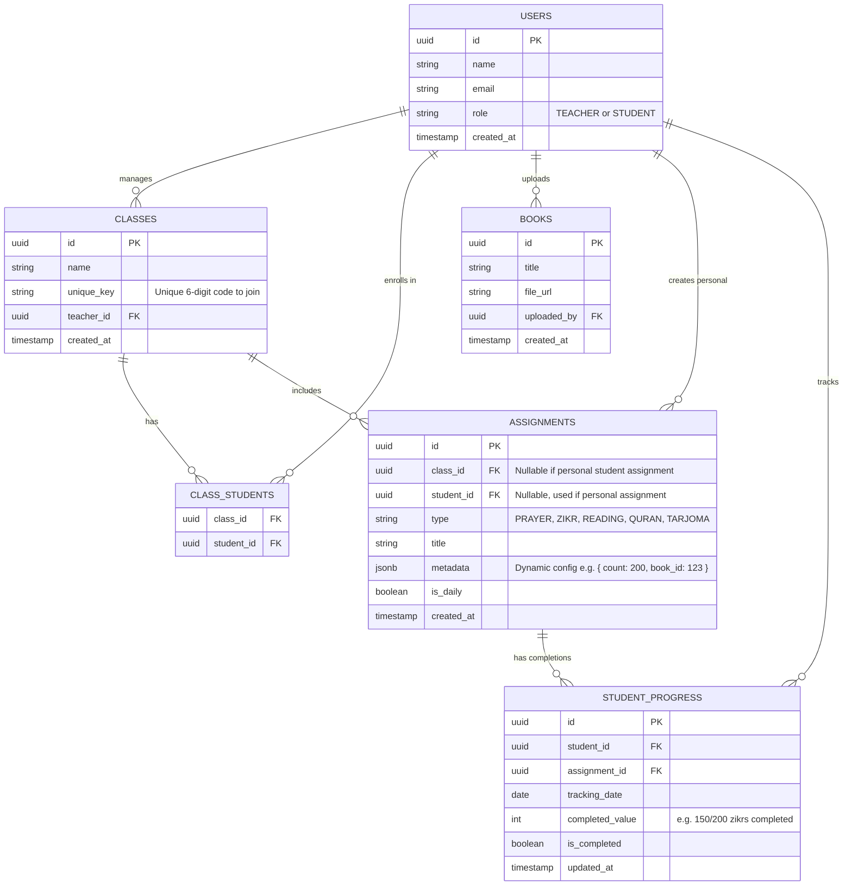

# Al-Mu'allim (Islamic Classroom App) Implementation Plan

Based on the requirements and the "Al-Mu'allim" designs provided, this application will serve as a platform for teachers to assign daily religious practices, track student progress, and allow students to build their own habits.

### Phase 5: UI Implementation (Student)

This phase focuses on the mobile-first student experience. The goal is to make it incredibly easy and rewarding for students to log their daily habits.

#### 1. Join Class Flow
- **`src/app/student/join/page.tsx`**: A simple, aesthetic screen where the student enters the 6-character Class Code provided by their teacher.
- **Server Action (`actions.ts`)**: 
  - Validates the code against the `classes` table.
  - Inserts a new record into `class_students` linking the student to the class.
  - Redirects them instantly to their new Dashboard.

#### 2. Student Dashboard (`src/app/student/dashboard/page.tsx`)
- **The "Salam" Header**: Welcomes the student by name and displays a 🔥 **Streak Counter** (calculated by checking consecutive days of activity in `student_progress`).
- **Data Fetching Engine**:
  - Fetch all active `assignments` from classes the student is enrolled in.
  - Fetch today's `student_progress` logs to see what is already done.
  - Group the assignments by `category` (e.g., all "Prayer" tasks together, all "Zikr" tasks together) so the UI perfectly matches the user's daily routine.

#### 3. Dynamic Assignment Completion Components
Because our assignments are infinitely flexible, our completion UI must be too. We will build two interactive Client Components:
- **`CheckboxTracker.tsx`**: For 'checkbox' assignments (like Prayers). A large, satisfying button. Tapping it instantly saves `{ is_completed: true }` to the database.
- **`CounterTracker.tsx`**: For 'counter' assignments (like 200 Zikr or 30 mins Sport). 
  - Displays a progress bar (e.g., 50/200).
  - Tapping it opens a quick "Log Progress" drawer where they can type a number, or use a "+" button like a digital Tasbeeh.
  - Saves the `quantity` to the database. If `quantity >= target`, it automatically marks `is_completed = true`.

#### 4. Personal Analytics (`src/app/student/analytics/page.tsx`)
- A visually rewarding page showing the student their completion rates over the week/month, helping them visualize their habit-building journey.

## Proposed GitHub Repository Names
- `al-muallim` (Based on the title in the design mockup)
- `tarbiyah-tracker`
- `deen-classroom`
- `sunnah-connect`

## Tech Stack Recommendations

### Database
**Recommendation:** **PostgreSQL**
*Why?* The app requires structured relationships (Teachers -> Classes -> Students -> Assignments), which is perfect for a robust relational database. However, the *types* of assignments are highly dynamic (e.g., Zikr counts, reading pages, prayer types). PostgreSQL's `JSONB` column type will allow us to store these dynamic assignment configurations (metadata) easily, giving us the best of both SQL and NoSQL worlds.

### Authentication
**Recommendation:** **Supabase Auth** or **Firebase Authentication**
*Why?* Both provide seamless, secure authentication that works identically across Web and Mobile. They support email/password, as well as social providers (Google, Apple). 
*Bonus:* If you choose Supabase, it pairs natively with PostgreSQL, providing a unified Backend-as-a-Service which will drastically speed up development for both web and mobile.

### Application Architecture
- **Web App:** Next.js (React) for a fast, responsive, and SEO-friendly web platform.
- **Mobile App (Future):** React Native (with Expo) to allow sharing code and concepts between the web and mobile platforms.
- **Backend API:** Next.js API routes (if using Supabase directly) OR a dedicated Node.js/Express server (if you want to keep the backend strictly separated).
- **Styling:** Tailwind CSS to easily and perfectly match the deep green (`#004D40` or similar) and modern glassmorphism aesthetics of your design.

## How a Single Table Handles All Assignment Types

In the ER diagram you provided, there are separate tables for Zikr, Books, Prayers, etc. While this works, it can quickly become difficult to maintain as you add more assignment types in the future. 

Instead, we can cover **all types** of assignments in a single `ASSIGNMENTS` table by using a `JSONB` (JSON) column called `metadata`. This allows the structure of the assignment to change dynamically based on its `type` without needing new tables or database migrations.

Here is how the `metadata` column would look for the different types you mentioned:

- **Zikr:**
  `{ "zikr_phrase": "Astaghfirullah", "target_count": 200 }`
- **Book Reading:**
  `{ "book_id": "uuid-of-book", "start_page": 10, "end_page": 20 }`
- **Prayer (5 Times a Day):**
  `{ "prayers_required": ["Fajr", "Dhuhr", "Asr", "Maghrib", "Isha"] }`
- **Specific Prayer (Tahajud/Nafl):**
  `{ "prayer_name": "Tahajud" }`
- **Quran Recitation:**
  `{ "surah_name": "Yaseen", "start_ayat": 1, "end_ayat": 83 }`
- **Quran Tarjoma:**
  `{ "surah_name": "Al-Baqarah", "start_ayat": 1, "end_ayat": 5 }`

The `STUDENT_PROGRESS` table then tracks the completion of these dynamic assignments. For example, for a Zikr assignment, the `completed_value` might be `150` (out of 200). For a book reading, `is_completed` would be set to `true`.

## Entity-Relationship (ER) Diagram

## Analytics Approach
To show analytics for teachers (how students are performing) and for students (their own streaks and performance):
- We will query the `STUDENT_PROGRESS` table, filtering by `tracking_date`.
- We can aggregate data to calculate "streaks" (consecutive days where `is_completed` is true).
- For class-wide analytics, the teacher queries all `STUDENT_PROGRESS` linked to `ASSIGNMENTS` that belong to their `class_id`.

## User Review Required

> [!IMPORTANT]
> Please review the proposed architecture, tech stack, and ER diagram. Let me know:
> 1. Which repository name you would like to use so I can initialize the project.
> 2. Do you prefer using **Supabase** (all-in-one Postgres DB + Auth) or a custom Node.js backend with something like MongoDB or Firebase?
> 3. Does the ER diagram capture all the dynamic assignment types you envisioned?
